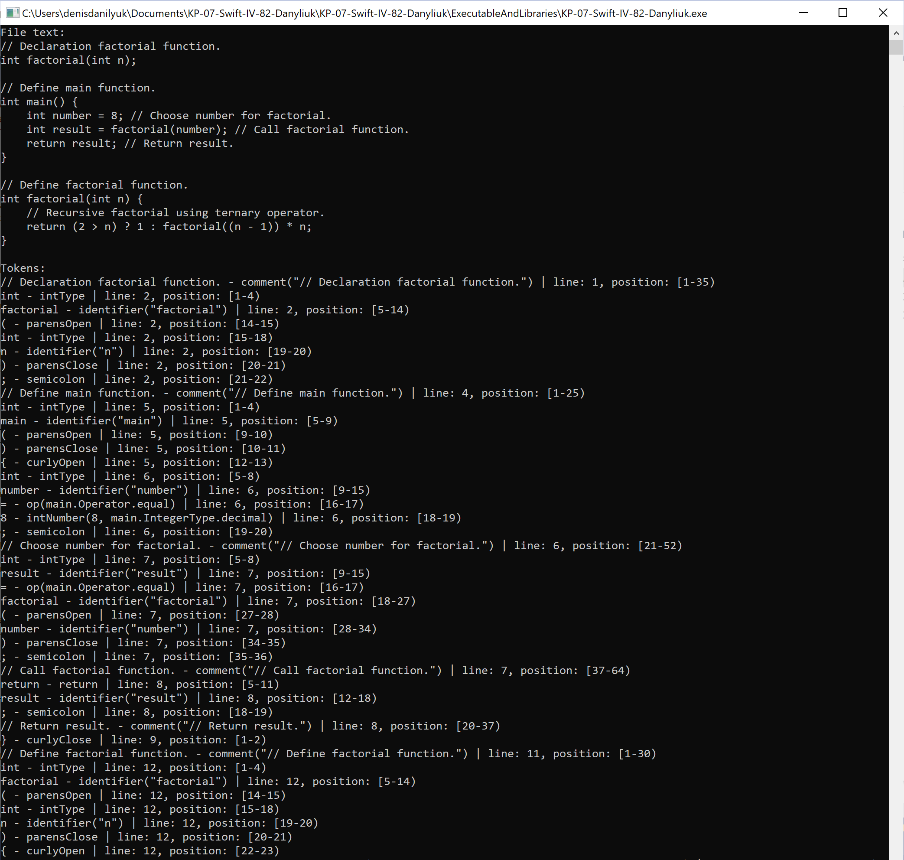
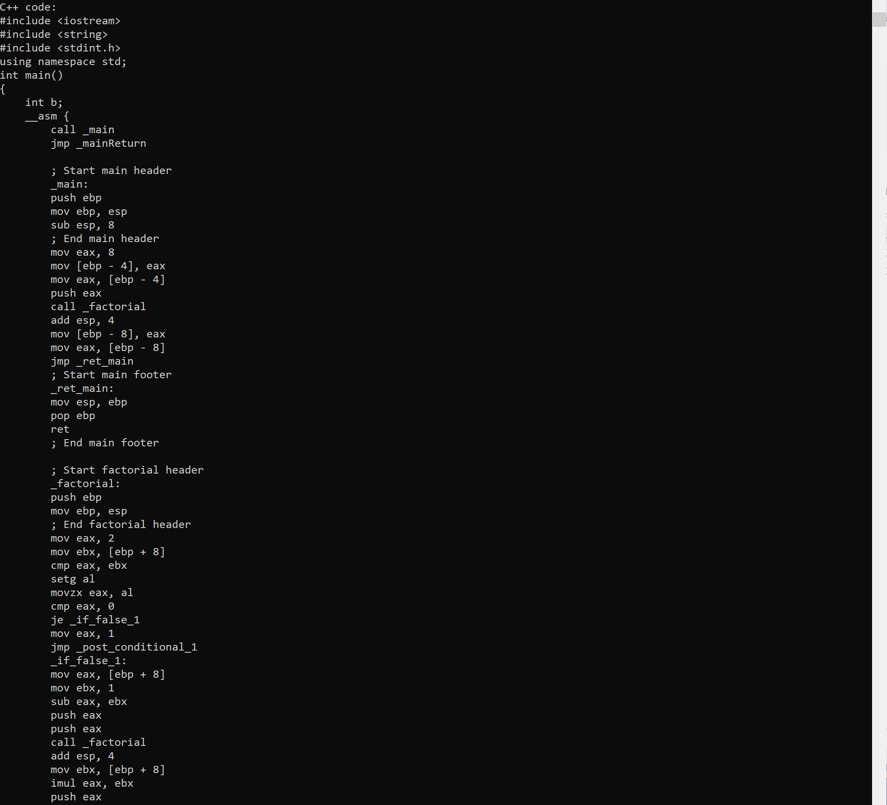

#  **C Complier to ASM written on Swift**

### Compiler:

- Lexing and parsing C code.
- Generating Cpp file with Inline assembler

### You can:

- Compile functions, do-while blocs, local variables and ternary operators. 

### Example:

